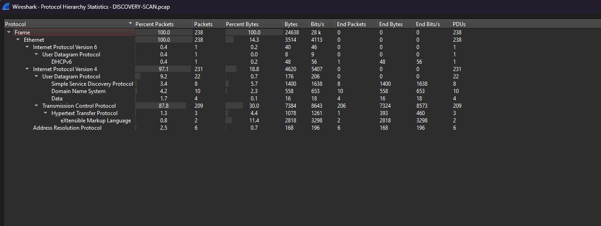
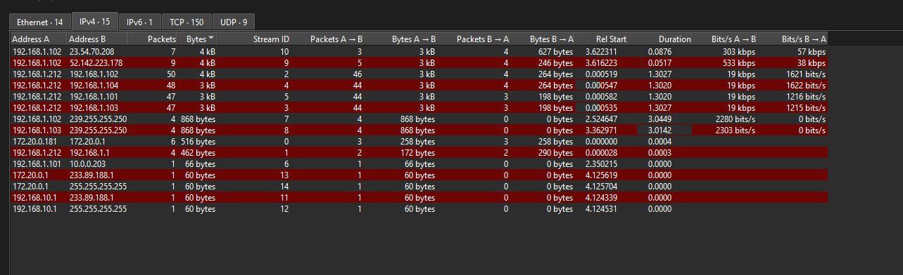
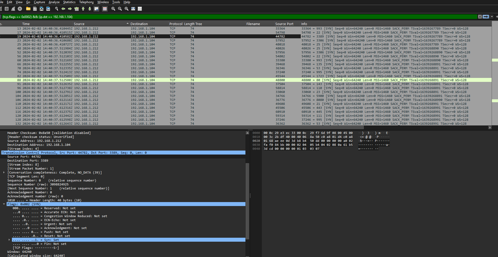
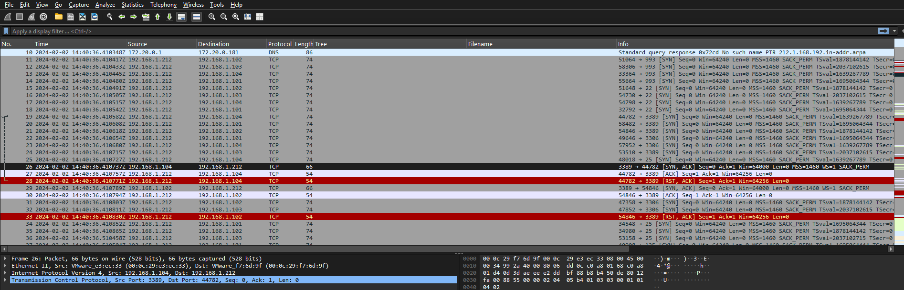
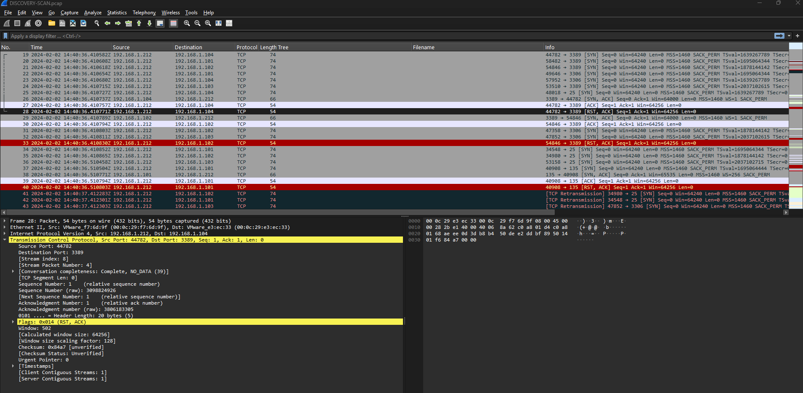
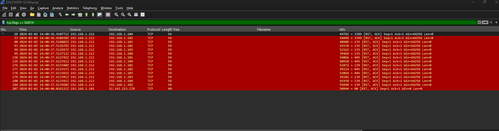

# MITRE ATT&CK Network Service Discovery Investigation

## Project Overview

This project documents a packet-capture investigation of suspicious network-service discovery activity using Wireshark. The analysis identified the scanning host, established the scope of the scan, counted the unique destination ports tested, verified open RDP services, and mapped the behavior to MITRE ATT&CK.

> **MITRE ATT&CK:** [T1046 - Network Service Discovery](https://attack.mitre.org/techniques/T1046/)  
> **Tactic:** Discovery  
> **Data source:** Packet capture (PCAP)  
> **Primary tool:** Wireshark

## Skills Demonstrated

- Packet-capture analysis with Wireshark
- TCP flag and display-filter analysis
- TCP three-way-handshake interpretation
- Port-scan and service-enumeration detection
- Identification of open and nonresponsive ports
- Network traffic scoping and background-noise separation
- MITRE ATT&CK technique mapping
- Evidence-based investigation reporting

## Investigation Questions and Answers

| Question | Finding |
|---|---|
| IP responsible for the discovery technique | `192.168.1.212` |
| First SYN event (UTC) | `2024-02-02 14:40:36.410417 UTC` |
| First SYN/ACK packet | Packet `26` |
| Number of IP addresses targeted | `4` |
| Number of unique ports scanned | `19` |
| Hosts with RDP open | `192.168.1.102`, `192.168.1.104` |

## Scope

The suspected scanner targeted the following internal systems:

- `192.168.1.101`
- `192.168.1.102`
- `192.168.1.103`
- `192.168.1.104`

The scan tested 19 unique TCP destination ports:

```text
21, 22, 23, 25, 53, 80, 110, 111, 135, 143,
443, 445, 993, 995, 1723, 3306, 3389, 5900, 8080
```

Repeated attempts were treated as retransmissions or repeated probes and were not counted as additional unique ports.

## Investigation Process

### 1. Establish the traffic baseline

Wireshark's Protocol Hierarchy showed that TCP represented 209 of 238 captured packets, or 87.8% of the traffic. This concentration supported further analysis of TCP connection attempts.



### 2. Identify the suspected scanner

TCP Conversations revealed that `192.168.1.212` communicated rapidly with four internal hosts. It sent substantially more packets than it received, a pattern consistent with automated probing.



### 3. Examine the SYN scan pattern

The initiating host sent SYN packets to multiple ports and systems within a short interval. The selected packet below shows an RDP probe from source port `44782` to destination port `3389`.

```wireshark
(tcp.flags == 0x0002) && (ip.dst == 192.168.1.104)
```



### 4. Confirm open RDP services

Packet `26` was the first SYN/ACK response. It was sent by `192.168.1.104` from TCP port `3389`, confirming that RDP was open. A separate SYN/ACK response confirmed RDP on `192.168.1.102`.

```text
SYN -> SYN/ACK -> ACK -> RST/ACK
```



### 5. Interpret the immediate reset

After completing the handshake, the scanner immediately sent RST/ACK without exchanging application data. Wireshark described the conversation as `Complete, NO_DATA`, which supports service identification rather than ordinary RDP use.



### 6. Identify other responding services

The reset activity also showed successful connections involving ports `135`, `139`, and `445`. The unrelated public-IP web connection was classified as background traffic and excluded from the discovery findings.



## Key Wireshark Filters

```wireshark
# Initial SYN packets
tcp.flags.syn == 1 && tcp.flags.ack == 0

# SYN probes from the scanning host
ip.src == 192.168.1.212 && tcp.flags.syn == 1 && tcp.flags.ack == 0

# SYN/ACK responses indicating open RDP
tcp.srcport == 3389 && tcp.flags.syn == 1 && tcp.flags.ack == 1

# RST/ACK packets
tcp.flags == 0x0014
```

## Findings

- `192.168.1.212` conducted rapid TCP service discovery against four internal hosts.
- The source tested 19 unique ports and repeated some unanswered probes.
- RDP was confirmed open on `192.168.1.102` and `192.168.1.104`.
- The scanner completed successful TCP handshakes and immediately reset the connections.
- No RDP application data was exchanged in the demonstrated connections.
- The activity is consistent with MITRE ATT&CK T1046, Network Service Discovery.

## Recommendations

1. Verify whether `192.168.1.212` is an authorized vulnerability scanner or administrative system.
2. Isolate or restrict the source if the activity is unauthorized.
3. Limit RDP access to approved management hosts through firewall rules or a secure VPN.
4. Review authentication and endpoint telemetry for follow-on RDP activity.
5. Restrict unnecessary exposure of ports `135`, `139`, and `445` between network segments.
6. Create alerts for rapid SYN activity targeting multiple ports or hosts.
7. Correlate the source with DHCP, asset inventory, EDR, and identity records.

## Important Limitation

This analysis confirms network-service discovery behavior, but the PCAP alone does not establish the operator's identity or prove malicious intent. Asset ownership and authorization records are required to distinguish an approved scan from unauthorized reconnaissance.

## Evidence Handling

The original PCAP is not included. Screenshots are provided for educational and portfolio purposes, and account-specific information has been excluded from the public evidence set.

